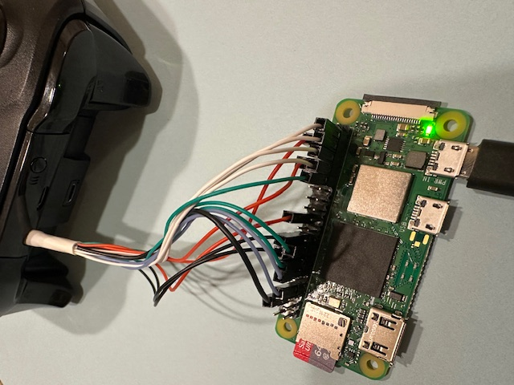

# PiXBox

Raspberry Pi Xbox Controller Interface

Unlike other implementations emulating Xbox controllers or enabling a Bluetooth connection, this project is a direct interface to the Raspberry Pi's GPIO pins. It is not a virtual joystick, but a direct connection to the controller's pins.

The intent is to use a web interface for controller functions, including macros and auto-clicker-like features.

This is a work in progress, and it may not be well maintained, as it was simply a learning project for me. I will provide updates as I have time.

### Wiring

You'll need a "sacrificial" Xbox controller to modify. I used a "1708" model, but nearly any wired or wireless controller should work (at least to some extent).

I found an extensive writeup on the [1708 controller's pins here](https://acidmods.com/forum/index.php/topic,43981.0.html). The [Acimods](https://www.acidmods.com) forum has several similar topics for various other controllers.

For each button on the controller, you'll need to carefully solder a wire to the corresponding test pin on PCB, per the writeup. The test pins are labeled "TP" on the PCB. For the 1708, the "B" button and trigger buttons should include a 100ohm resistor in series. You'll also need a ground wire (available on any number of pads). The analog sticks should probably not be connected to the Pi, as they do not behave like buttons.

I was able to route all of these bodge wires through a drilled hole opposite the sync button on the front of the controller. I crimped DuPont header connectors onto each for connection to the Raspberry Pi's 40 pin GPIO header.

The pinout that I used can be found in the [default.json](config/default.json) file. That file can be modified to suit your needs.

Since the controller does not provide easy access to 5VDC except when wired via USB, I powered the Pi with an external USB power supply (battery bank or wall wart).

I used a Raspberry Pi Zero 2 W, but nearly any Raspberry Pi should work, including the Pi Zero W (32 bit). Recommend Debian Bookworm headless, but Buster should work as well.

3D print a simple case or use a Raspberry Pi enclosure and use velcro or mounting tape to secure the Pi to the controller.



### Installation

Install [Node.js](https://nodejs.org/en/download/package-manager). Recommend using the NVM based installer to get the latest LTS version.

Install and configure autobind (for user level access to port 80):
```
sudo apt install autobind
sudo touch /etc/authbind/byport/80
sudo touch /etc/authbind/byport/80
user=$(whoami)
sudo chown $user:$user /etc/authbind/byport/80
sudo chmod 755 /etc/authbind/byport/80
```

Download the release tarball from this repository's release page.

Unpack the tarball (`tar xvf release.tar.gz`) and run `npm install --omit=dev` in the unpacked directory.

If the Pi complains about memory errors during `npm install`, you may need to temporarily increase the some swap space.

Use `npm start` to start the server.

### Usage

Open a web browser and navigate to your Pi's IP address in a web browser.

The wep app provides a controller interface that presses buttons interactively.

Actions (macros) are defined in the `config/default.json` file and managed via the web app. Each can be triggered manually with the "Execute Now" button. If no repeat count is specified, the action will execute once and then stop.

Each button press and release should be specifically defined in the action. If the action is to be repeated multiple times, it may be useful to specify a delay as the last step of the action. Button presses should register after only a few milliseconds, so delays between presses/releases can be quite short (5-10ms).

Once an action is complete, all buttons will be released to manual control, and the controller can be used normally.

"Triggers" can be enabled for an action to execute when a button is pressed/released. The "then" line of the action defines button press/release that will trigger the action. Multiple triggers can be enabled at once (but only one per trigger button).

Confusingly, the physical triggers on the controller cannot be used as action triggers, due to the hardware limitations of the controller (they are analog and cannot be polled like the rest of the buttons). They can be mapped to GPIO pins, though, and we can emulate a full trigger press by pulling the pin low.

Some example macros are included in the `config/default.json` file.